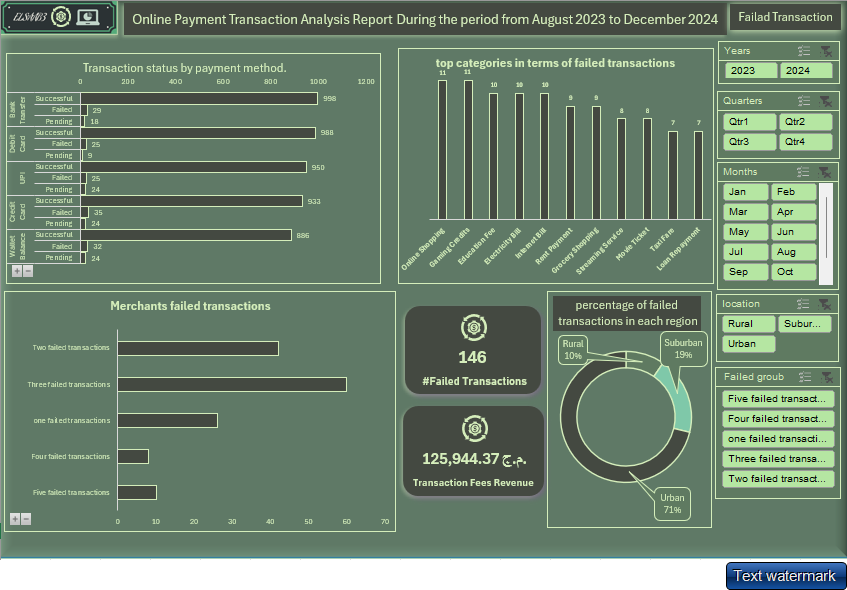
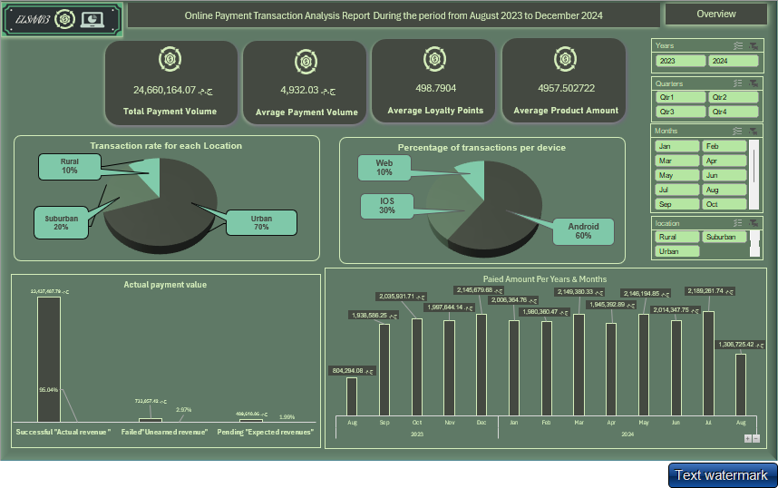

# Online Payment Transaction Analysis

## Project Overview
This project provides a comprehensive analysis of online payment transactions through data visualizations. It aims to identify trends, detect issues, and provide actionable insights into transaction behavior across regions, devices, and payment methods. Key metrics such as transaction counts, revenue, device types, and payment method success/failure rates are explored to optimize the payment system. The full report is available in the [Wallet Transaction Report PDF](wallet_transaction_report_project.pdf).

## Dashboard Preview
Below is a screenshot of the dashboard visualizing the transaction data:

## Data Description
The dataset includes records of online payment transactions with the following details:
- **Transaction Status**: Success or failure of each transaction.
- **Payment Method**: The method used (e.g., credit card, digital wallet).
- **Transaction Device**: The type of device (e.g., mobile, desktop).
- **Region**: The geographical region of the transaction.
- **Transaction Value**: The monetary value of transactions.
- **Transaction Fees**: Fees associated with successful transactions.

The data spans a specific time period, with monthly trends analyzed to uncover patterns and anomalies.

## Visualizations
The project employs multiple chart types to visualize the transaction data, as detailed in the [report](./docs/wallet_transaction_report_project.pdf):

1. **Cards**:
   - Display aggregate metrics such as total transactions, total revenue, and other key figures for a quick overview.

2. **Pie Charts**:
   - **Region Contribution**: Shows the percentage of transactions per region.
   - **Device Type Contribution**: Illustrates the distribution of devices used for transactions (e.g., mobile vs. desktop).

3. **Clustered Column Chart**:
   - Visualizes the revenue from successful transactions, reflecting the financial outcome of the payment system.

4. **Combo Chart (Clustered Column + Trend Line)**:
   - Displays the total transaction value over time, with a trend line highlighting a notable decrease in August.

5. **Bar Charts**:
   - Represent the transaction status (success/failure) for each payment method.
   - Enable identification of the most used methods and those with high failure rates.

6. **Donut Chart**:
   - Shows the percentage of failed transactions by region.
   - Paired with a Card to display revenue or profit from transaction fees.

## Key Insights
The analysis, detailed in the [report](./docs/wallet_transaction_report_project.pdf), uncovers critical findings:
- **Transaction Value Drop**: A significant decrease in transaction value occurred in August, as shown in the Combo Chart.
- **Payment Method Issues**: Bar Charts highlight payment methods with high failure rates, suggesting areas for improvement.
- **Regional Performance**: The Donut Chart identifies regions with higher failure rates, warranting further investigation.
- **Device Distribution**: The Pie Chart reveals the proportion of devices used, aiding in platform-specific optimizations.

## How to Use the Project
1. **View the Report**: Download and review the [Wallet Transaction Report PDF](./docs/wallet_transaction_report_project.pdf) for detailed insights and visualizations.
2. **Explore the Dashboard**: Refer to the dashboard screenshot above or recreate it using the provided data and tools.
3. **Reproduce the Analysis**:
   - Access the dataset in the `/data` folder.
   - Use tools like Excel, Power BI, or Tableau to recreate the charts.
   - Refer to instructions in the `/docs` folder for setup guidance.
4. **Explore the Code**: If available, check the `/src` folder for data processing scripts.

## Repository Structure
- `/data`: Contains the raw and processed transaction datasets.
- `/docs`: Includes the [Wallet Transaction Report PDF](./docs/wallet_transaction_report_project.pdf) and other documentation.
- `/images`: Contains the [dashboard screenshot](./images/dashboard_screenshot.png).
- `/src`: Includes any scripts used for data processing (if applicable).
- `README.md`: This file.

## Dependencies
To interact with the project, you’ll need:
- **PDF Viewer**: To view the [report](./docs/wallet_transaction_report_project.pdf).
- **Visualization Tools**: Excel, Power BI, or Tableau for analysis reproduction.
- **Programming Environment** (optional): For running any included scripts.

## Contact
For questions or issues, submit an issue on the GitHub repository or contact [Your Name] at [Your Email Address].
